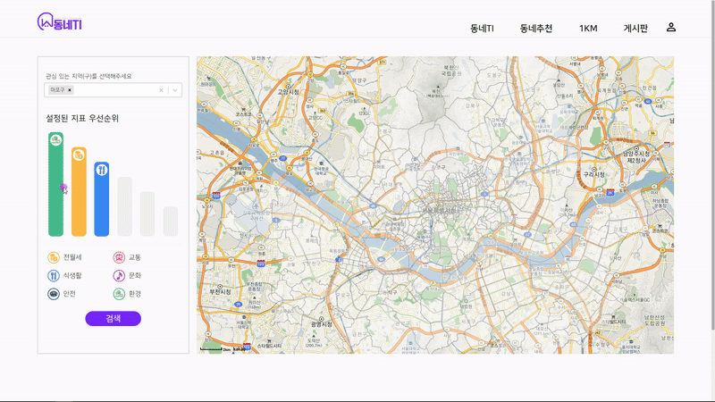
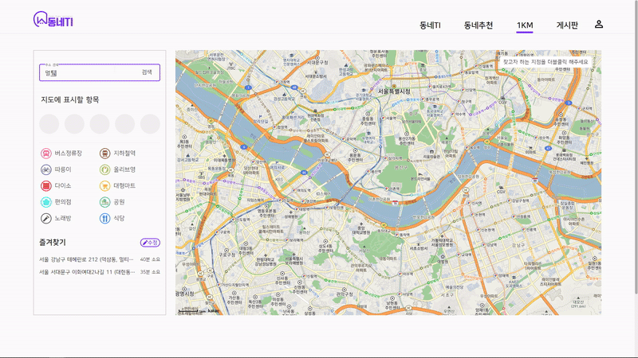
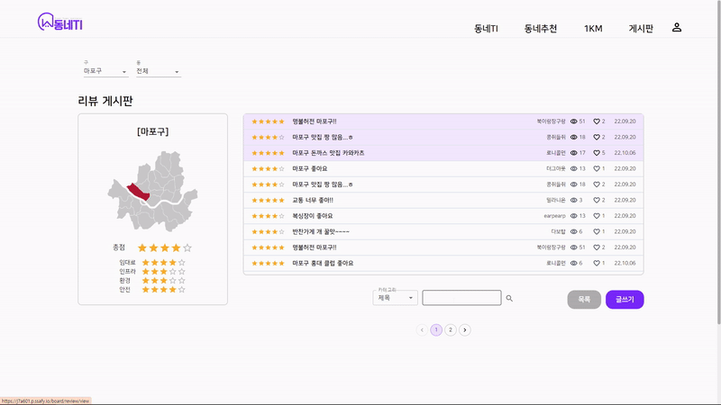
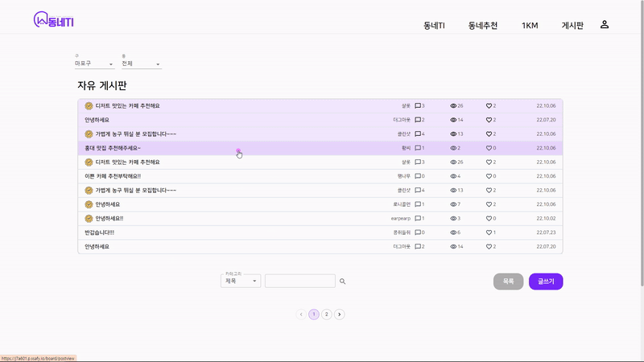
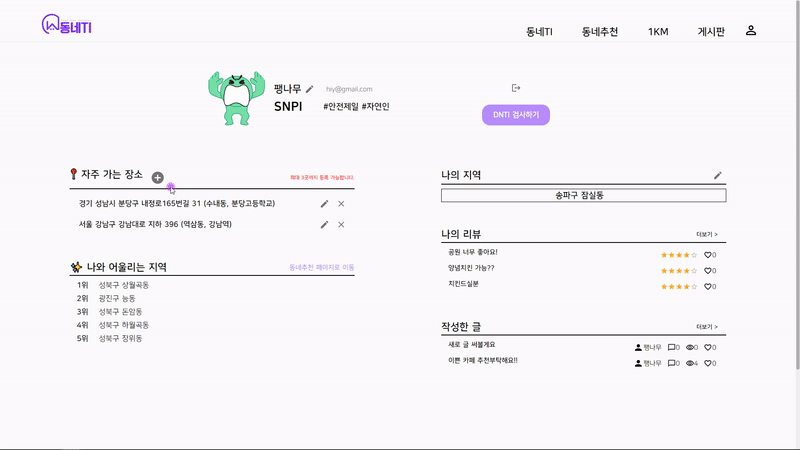
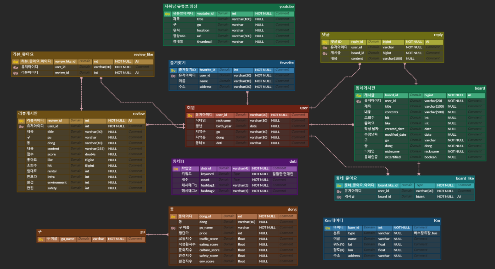
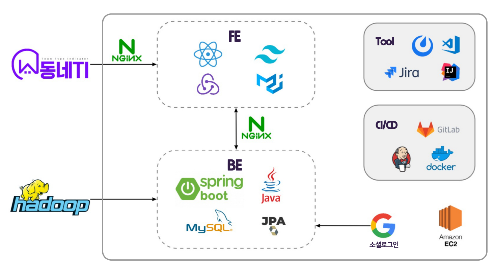
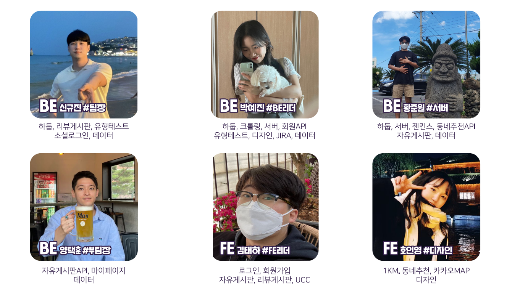

## 프로젝트 소개

동네TI는 MBTI처럼 간단한 테스트를 통해 사용자의 유형을 파악하고 그에 맞는 동네를 추천해주는 서비스입니다.

## 주요 기능

### 동네 유형 검사

- 간단한 밸런스 게임을 통해 사용자의 동네 유형을 검사하는 기능입니다.
- 선택지에 따라 점수를 주고 이를 32개의 유형으로 나누었습니다.

### 동네 추천 기능

- 사용자 유형이나 지정한 지표를 통해 동네를 추천해주는 기능입니다.
- 약 100만 개의 공공 데이터를 하둡 맵리듀스를 사용해 정제하고 점수로 환산했습니다.
- 이렇게 환산한 점수에 사용자 유형에 따라 가중치를 두어 총점을 계산하고 순위를 나눠 추천해주었습니다.
    

    

### 1KM 인프라 찾기

- 지도에서 사용자가 지정한 지점 직경 1KM의 실질적인 인프라 (올리브영, 노래방, 다이소, 마트 등) 들을 마커로 표시해주는 기능입니다.
- 즐겨찾기로 등록한 장소는 지정한 좌표에서 대중교통으로 걸리는 시간을 알려줍니다.
    

    

### 자유/리뷰 게시판

- 4개의 주제로 실제 사는 동네에 점수를 매기고 이를 다른 사람들이 확인할 수 있는 기능입니다.
    

    
- 자유게시판에서는 실제 거주자는 인증 마크가 달린 글을 작성할 수 있고 외지 사람과 소통할 수 있습니다.
- 동 별로 게시판이 나눠져있어 원하는 동네의 정보를 얻을 수 있습니다.
    

    

### 마이페이지

- 맞춤 데이터를 추천받기 위해 즐겨찾는 장소, 현재 거주 지역 등을 설정할 수 있습니다.
    

    

## 기술스택

<h3 align="center">Back-end</h3>

	
    
    
    
    

<h3 align="center">Front-end</h3>

	
    
    
    

<h3 align="center">CI/CD</h3>

	
	
	
    
    

 

## ERD

## 아키텍처

## 팀원소개 및 역할

