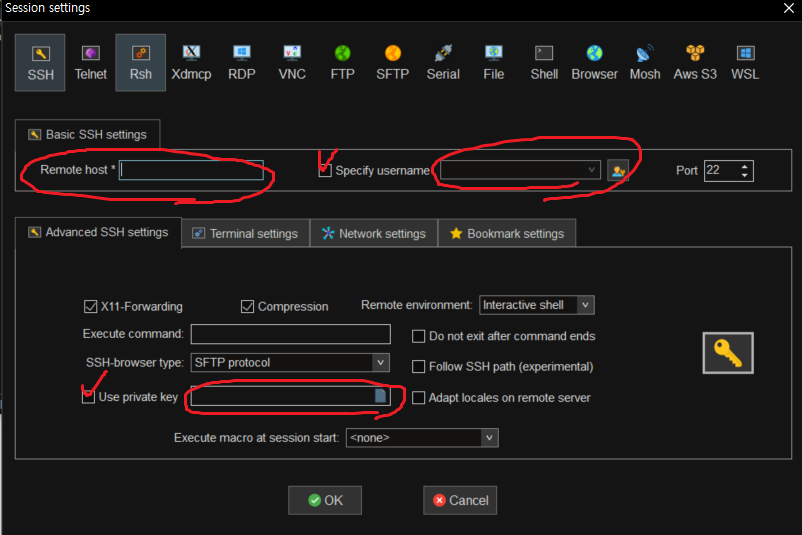
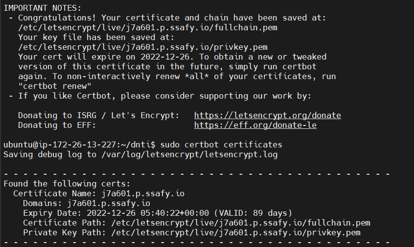

## 버전 정보

- 호스트 머신(EC2) 설정
    - Ubuntu : `20.04.05`
    - Docker : `20.10.18`
    - Docker-compose : `1.26.0`
- Front-end 설정
    - Node : `16.15.0`
    - npm : `8.5.5`
    - Nginx : `1.18.0`
- Back-end 설정
    - openjdk version "1.8.0_192”
    - OpenJDK Runtime Environment (Zulu 8.33.0.1-win64) (build 1.8.0_192-b01)
    - OpenJDK 64-Bit Server VM (Zulu 8.33.0.1-win64) (build 25.192-b01, mixed mode)
    - Spring Framework : `2.7.3`
- IDE 설정
    - IntelliJ 2022.1.3

## EC2 원격 접속

### MobaXTerm 설치

다운로드 링크 : 

[MobaXterm free Xserver and tabbed SSH client for Windows](https://mobaxterm.mobatek.net/download.html)

### 설치 후 연결

1. 실행 후에 왼쪽 상단의 Session 클릭
2. SSH 연결



- Remote host에 Public IP 입력
- Specify username에 사용할 유저 이름 입력 (현 프로젝트는 ubuntu 사용)
- Use private key에 받은 pem키 입력
- OK 누르면 연결 완료

## Docker와 Docker-compose 설치

### Docker

1. 유틸 설치
    
    ```bash
    sudo apt update
    sudo apt install apt-transport-https ca-certificates curl software-properties-common
    ```
    
2. 키 생성
    
    ```bash
    curl -fsSL https://download.docker.com/linux/ubuntu/gpg | sudo apt-key add -
    ```
    
3. Repository 추가 후 Update
    
    ```bash
    sudo add-apt-repository "deb [arch=amd64] https://download.docker.com/linux/ubuntu $(lsb_release -cs) stable"
    sudo apt update
    ```
    
4. Docker 설치
    
    ```bash
    sudo apt install docker-ce
    ```
    
5. Docker 설치 확인
    
    ```bash
    sudo systemctl status docker
    ```
    
6. Docker 권한 설정 (설정한 유저 이름)
    
    ```bash
    sudo usermod -aG docker ${USER}
    ```
    
7. Permission denied 가 뜰 때
    
    ```bash
    sudo chmod 666 /var/run/docker.sock
    ```
    

### Docker-compose

1. Docker-compose 설치
    
    ```bash
    sudo curl -L "https://github.com/docker/compose/releases/download/1.26.0/docker-compose-$(uname -s)-$(uname -m)" -o /usr/local/bin/docker-compose
    ```
    
2. 심볼릭 링크 생성, 실행 권한 부여
    
    ```bash
    sudo ln -s /usr/local/bin/docker-compose /usr/bin/docker-compose
    sudo chmod +x /usr/bin/docker-compose
    ```
    
3. 설치 확인
    
    ```bash
    docker-compose -v
    ```
    

## DB Init

1. 서비스 배포를 위한 디렉토리 생성
    
    ```bash
    cd /home/ubuntu
    mkdir dnti
    cd dnti
    ```
    
2. Nginx 배포를 위한 디렉토리 생성
    
    ```bash
    mkdir db
    ```
    
    - `db` : 스키마와 유저를 생성하기 위한 sql이 들어가는 디렉토리
3. `init.sql` 작성
    
    ```bash
    vim ./db/init.sql
    ```
    
    - 만약 vim이 설치되어 있지 않을 경우 vim 설치 후 진행
        
        ```bash
        sudo apt-get update
        sudo apt-get install vim
        ```
        
    - `init.sql` 내용
        - DB와 User를 생성. (dnti 와 a601)
        - User에 모든 권한을 주는 명령어
        - DB UserId : a601 / Password : ssafyA601
        
        ```bash
        create database IF NOT EXISTS `dnti` collate utf8mb4_general_ci;
        create user 'a601'@'%' identified by 'ssafyA601';
        grant all privileges on *.* to a601@'%';
        flush privileges;
        ```
        
4. MySQL과 기본 실행 쿼리를 위한 `docker-compose.yml` 내용 (프로젝트의 최상위 폴더에 작성)
    
    ```bash
    # docker-compose version
    version: "3.8"
    
    #container list
    services:
      db:
        image: mysql:5.7
        container_name: mysql
        restart: always
        volumes:
          # Mount cotainer drive to real drive
          - ./db:/docker-entrypoint-initdb.d
        networks:
          # network inside of a container
          - app-network
        ports:
          - "32000:3306"
        environment:
          MYSQL_ROOT_PASSWORD: ssafyA601
          TZ: "Asia/Seoul"
        privileged: true
    ```
    
    - 해당 내용은 추가적인 내용들을 모두 작성 후 아래에서 `docker-compose up` 할 예정입니다.
    - 현재는 DB의 데이터를 volume 설정 해놓지 않아서 컨테이너가 종료되면 데이터가 사라짐
        - 설정을 위해서는 `-/db/<임의의 폴더명>:/var/lib/mysql` 를 추가
    - 포트는 EC2의 32000번 포트와 컨테이너의 3306 포트가 연결되어 있음
    - 포트도 32000이 아닌 3306으로 설정하는 것이 좋음

## Back-end 배포

### Local에서 빌드하여 jar 파일 실행하기

1. Local 워크스페이스 `/backend` 경로에서 터미널로 빌드 
    
    ```bash
    ./gradlew clean build
    #또는
    ./gradlew bootJar
    ```
    
2. 서버 접속 후 Build한 파일을 넣을 폴더 생성
    
    ```bash
    cd /home/ubuntu/dnti
    mkdir build
    ```
    
3. 로컬에서 /backend/build/libs/<파일명>.jar 경로에 생성된 jar 파일을 서버에 업로드
    - 경로 : `/home/ubuntu/dnti/build/libs`
4. Build한 jar를 실행하기 위한 `docker-compose.yml`
    
    ```bash
    vim docker-compose.yml
    ```
    
    - 위치 `ubuntu/dnti`
    - 내용
        
        ```bash
        # docker-compose version
        version: "3.8"
        
        #container list
        services:
          dnti:
            build:
              context: ./
            container_name: dnti
            restart: always
            ports:
              - "9090:9090"
            environment:
              TZ: "Asia/Seoul"
              # Spring application.properties DB
              SPRING_DATASOURCE_URL: "jdbc:mysql://db:3306/dnti?userUnicode=true&characterEncoding=utf8&serverTimezone=Asia/Seoul&zeroDateTimeBehavior=convertToNull&rewriteBatchedStatements=true"
              server.address: 0.0.0.0
            networks:
              - app-network
            depends_on:
              - db
        ```
        
        - 위에서 작성한 db docker-compose.yml 파일에 합쳐서 작성
        - 포트는 앞의 포트가 EC2의 포트, 뒤의 포트가 컨테이너에서 서버가 할당되는 포트
        - 전체 docker-compose.yml 파일
        
        ```bash
        # docker-compose version
        version: "3.8"
        
        #container list
        services:
          db:
            image: mysql:5.7
            container_name: mysql
            restart: always
            volumes:
              # Mount cotainer drive to real drive
              - ./db:/docker-entrypoint-initdb.d
            networks:
              # network inside of a container
              - app-network
            ports:
              - "32000:3306"
            environment:
              MYSQL_ROOT_PASSWORD: ssafyA601
              TZ: "Asia/Seoul"
            privileged: true
          dnti:
            image: dnti
            container_name: dnti
            restart: always
            ports:
              - "9090:9090"
            environment:
              TZ: "Asia/Seoul"
              # Spring application.properties DB
              SPRING_DATASOURCE_URL: "jdbc:mysql://db:3306/dnti?userUnicode=true&characterEncoding=utf8&serverTimezone=Asia/Seoul&zeroDateTimeBehavior=convertToNull&rewriteBatchedStatements=true"
              server.address: 0.0.0.0
            networks:
              - app-network
            depends_on:
              - db
        
        networks:
          app-network:
            driver: bridge
        ```
        
5. docker-compose 명령어 실행 (docker-compose.yml 파일이 있는 위치에서)
    - `docker-compose up -d`
    - 컨테이너 확인
        - `docker ps`

## Front-end 배포

참고 : 

[AWS + NGINX HTTPS(SSL) 적용](https://insight-bgh.tistory.com/311)

[[AWS에 Spring 초간단 배포하기] Nginx, Let's Encrypt를 사용한 HTTPS 설정](https://steady-coding.tistory.com/629)

### Front-end 빌드

1. Frontend 폴더에서 npm install
2. 이어서 npm run build
3. 빌드 성공 후 생긴 dist 폴더나 build 폴더를 EC2 안으로 붙여넣기
- EC2 컨테이너 안에 프론트 빌드 폴더인 dist 파일을 넣으면 서버 도메인으로 들어갈 때 찾아서 보여줌
- nginx설정을 통해 프론트 빌드 파일에 접근함

→ 결과적으로 젠킨스를 사용할 때 프론트엔드를 빌드하고 이미지를 만들고 컨테이너를 만드는 과정이 필요 없이 프론트엔드를 빌드하고 생긴 dist(우리는 build) 폴더를 EC2에 저장해주면 배포 완료

### Nginx 설정

1. nginx와 letsencrypt 설치
    
    ```bash
    sudo apt-get update
    sudo apt install nginx -y
    sudo apt install letsencrypt -y 
    ```
    
2. nginx 중지 후 인증서 발급
    
    ```bash
    sudo systemctl stop nginx    # 중지 (상태 확인 필요)
    sudo letsencrypt certonly --standalone -d <domain>   # 발급
    ```
    
- 발급 완료되면 인증서가 저장된 위치가 뜸



- `sudo certbot certificates` 명령어를 통해 인증서 확인 가능
    - `certbot renew` 명령어를 통해 재발급 가능
3. nginx 설정 파일 수정
    - 컨테이너의 `/etc/nginx/sites-available`의 `default.conf` 파일을 수정
    - sudo 권한 필요 `sudo vim default`
    - `root` 부분을 프론트 빌드된 폴더로 설정

```bash
server {
	listen 80;
	listen [::]:80;

	server_name j7a601.p.ssafy.io;
	index index.html index.htm;
	# 프론트 빌드 폴더의 위치
	root /home/ubuntu/dnti/dist;

	location ~ /.well-known/acme-challenge {
		allow all;
		root /var/www/html;
	}

	location / {
		rewrite ^ https://$host$request_uri? permanent;
		try_files $uri $uri/ /index.html;
	}

	location /api {
  		proxy_pass http://j7a601.p.ssafy.io:9090;
	}
}

server {
	listen 443 ssl http2;
	listen [::]:443 ssl http2;
	server_name j7a601.p.ssafy.io;

	index index.html index.htm;
	# 프론트 빌드 폴더의 위치
	root /home/ubuntu/dnti/dist;

	server_tokens off;
	client_max_body_size 100M;

	ssl_certificate /etc/letsencrypt/live/j7a601.p.ssafy.io/fullchain.pem;
	ssl_certificate_key /etc/letsencrypt/live/j7a601.p.ssafy.io/privkey.pem;

	add_header X-Frame-Options "SAMEORIGIN" always;
	add_header X-XSS-Protection "1; mode=block" always;
	add_header X-Content-Type-Options "nosniff" always;
	add_header Referrer-Policy "no-referrer-when-downgrade" always;
	add_header Content-Security-Policy "default-src * data: 'unsafe-eval' 'unsafe-inline'" always;
	# add_header Strict-Transport-Security "max-age=31536000; includeSubDomains; preload" always;
	# enable strict transport security only if you understand the implications

	location / {
		try_files $uri /index.html;
	}

	location /api {
  		proxy_pass http://j7a601.p.ssafy.io:9090;
	}
}
```

4. nginx 재시작
- `sudo systemctl start nginx`
